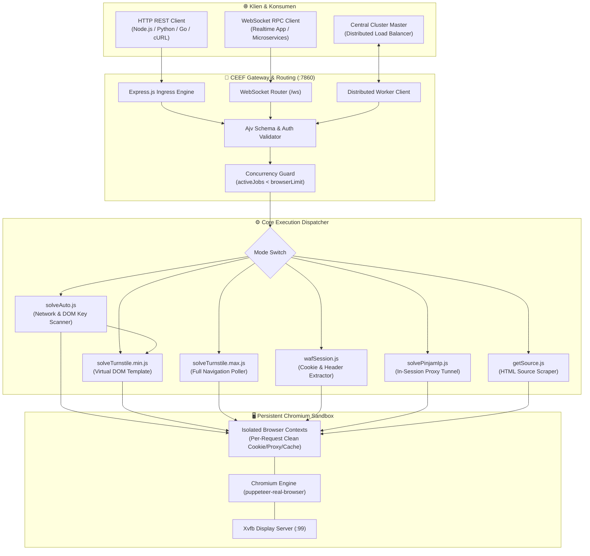
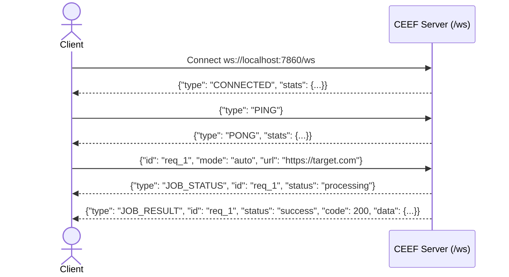

<div align="center">

# ⚡ CEEF WAF & TURNSTILE SOLVER
### *High-Performance Cloudflare WAF Bypass, Turnstile Captcha Solver & Real-Browser Emulation Engine*

[](https://hub.docker.com/)
[](https://nodejs.org/)
[](docs/API_REFERENCE.md)
[](LICENSE.md)

<p align="center">
  <b>CEEF WAF Solver</b> adalah mesin otomasi peramban tingkat tinggi berbasis <b>Node.js, Express, WebSocket, dan Puppeteer-Real-Browser</b> yang dirancang khusus untuk melewati proteksi ketat <b>Cloudflare WAF, JavaScript Challenge, Turnstile Captcha, dan Bot Management</b> secara efisien, aman, dan berkecepatan tinggi.
</p>

[🏛️ Arsitektur](docs/ARCHITECTURE.md) • [📚 Referensi API](docs/API_REFERENCE.md) • [🧩 Panduan Mode](docs/MODES_GUIDE.md) • [💻 Contoh Klien](docs/CLIENT_EXAMPLES.md) • [🚀 Panduan Deployment](docs/DEPLOYMENT_GUIDE.md) • [🛠️ Troubleshooting](docs/TROUBLESHOOTING.md)

---

</div>

## 📑 Daftar Isi Master

1. [🌟 Mengapa CEEF WAF Solver?](#1--mengapa-ceef-waf-solver)
2. [🏛️ Diagram Arsitektur & Alur Kerja](#2-️-diagram-arsitektur--alur-kerja)
3. [🧩 6 Mode Operasi Inti (Core Solver Modes)](#3--6-mode-operasi-inti-core-solver-modes)
   - [Mode 1: `auto` (Smart Zero-Config Solver)](#-mode-auto-smart-zero-config-solver)
   - [Mode 2: `turnstile-min` (Lightweight Virtual DOM Solver)](#-mode-turnstile-min-lightweight-virtual-dom-solver)
   - [Mode 3: `turnstile-max` (Full Page Dynamic Turnstile Solver)](#-mode-turnstile-max-full-page-dynamic-turnstile-solver)
   - [Mode 4: `waf-session` (Cookie Clearance & Header Generator)](#-mode-waf-session-cookie-clearance--header-generator)
   - [Mode 5: `pinjam-ip` / `ip-bound` (In-Session Request Tunnel)](#-mode-pinjam-ip--ip-bound-in-session-request-tunnel)
   - [Mode 6: `source` (Full Rendered HTML Scraper)](#-mode-source-full-rendered-html-scraper)
4. [🚀 Panduan Memulai Cepat (Quickstart)](#4--panduan-memulai-cepat-quickstart)
   - [A. Menggunakan Docker (Direkomendasikan)](#a-menggunakan-docker-direkomendasikan)
   - [B. Instalasi Manual / Bare-Metal Linux & Windows](#b-instalasi-manual--bare-metal-linux--windows)
   - [C. Pterodactyl Panel / Container Tanpa Root](#c-pterodactyl-panel--container-tanpa-root)
5. [📚 Referensi Lengkap HTTP REST API](#5--referensi-lengkap-http-rest-api)
   - [Endpoint Status: `GET /`](#endpoint-status-get-)
   - [Endpoint Utama: `POST /cf-clearance-scraper`](#endpoint-utama-post-cf-clearance-scraper)
   - [Tabel Parameter & Skema Request](#tabel-parameter--skema-request)
   - [Format Respon & Error Codes](#format-respon--error-codes)
6. [⚡ Protokol WebSocket RPC Real-time (`/ws`)](#6--protokol-websocket-rpc-real-time-ws)
   - [Inbound Client Connection](#inbound-client-connection)
   - [Outbound Distributed Worker Mode](#outbound-distributed-worker-mode)
7. [💻 Contoh Implementasi Multi-Bahasa](#7--contoh-implementasi-multi-bahasa)
   - [Node.js / JavaScript (Fetch & Axios)](#nodejs--javascript-fetch--axios)
   - [Node.js + CycleTLS (JA3 Fingerprint Matching)](#nodejs--cycletls-ja3-fingerprint-matching)
   - [Python (Requests & tls-client)](#python-requests--tls-client)
   - [Go (Golang)](#go-golang)
   - [cURL & Bash CLI](#curl--bash-cli)
8. [🔬 Bedah Teknologi: Bagaimana CEEF Melewati Cloudflare?](#8--bedah-teknologi-bagaimana-ceef-melewati-cloudflare)
   - [1. Eliminasi Flag Automasi & Patching CDP](#1-eliminasi-flag-automasi--patching-cdp)
   - [2. Xvfb Virtual Framebuffer vs Headless Standar](#2-xvfb-virtual-framebuffer-vs-headless-standar)
   - [3. Masalah IP-Bound Cookie & Solusi Pinjam-IP](#3-masalah-ip-bound-cookie--solusi-pinjam-ip)
   - [4. Virtual DOM Template Injection](#4-virtual-dom-template-injection)
9. [⚙️ Konfigurasi Lingkungan (Environment Variables)](#9-️-konfigurasi-lingkungan-environment-variables)
10. [📊 Optimasi Performa, Kapasitas RAM & Concurrency](#10--optimasi-performa-kapasitas-ram--concurrency)
11. [🛠️ Pemecahan Masalah & Diagnostik Cepat](#11-️-pemecahan-masalah--diagnostik-cepat)
12. [⚖️ Lisensi & Pernyataan Batasan Tanggung Jawab](#12-️-lisensi--pernyataan-batasan-tanggung-jawab)

---

## 1. 🌟 Mengapa CEEF WAF Solver?

Banyak scraper dan bot modern gagal saat berhadapan dengan Cloudflare karena Cloudflare tidak hanya memeriksa *cookie* atau *header*, melainkan memvalidasi:
- **TLS/JA3/JA4 Fingerprints**: Urutan cipher suite dan ekstensi kriptografi SSL/TLS.
- **HTTP/2 Frame Heuristics**: Urutan frame Akamai/Cloudflare `SETTINGS`, `WINDOW_UPDATE`, dan `PRIORITY`.
- **Canvas & WebGL Entropy**: Konsistensi render grafis pada GPU/layar.
- **Runtime Environment Integrity**: Pengecekan flag internal seperti `navigator.webdriver`, `chrome.runtime`, dan artefak Chrome DevTools Protocol (CDP).

**CEEF WAF Solver memecahkan seluruh kendala tersebut dengan:**
1. **Single Persistent Real-Browser Engine**: Menggunakan satu instance Chromium nyata yang telah di-patch, berjalan di atas display virtual **Xvfb**, mengeliminasi overhead startup berulang dan mendeteksi sesi sebagai browser pengguna asli 100%.
2. **Context Isolation**: Setiap request dijalankan di dalam `BrowserContext` terisolasi dengan cookie, cache, dan proxy tersendiri tanpa kebocoran data (*zero state contamination*).
3. **Mekanisme Injeksi Virtual DOM**: Memungkinkan pembuatan token Turnstile hanya dalam **1.8 - 3 detik** dengan konsumsi RAM **~25 MB**, tanpa memuat asset halaman target yang berat.
4. **Mode "Pinjam-IP" Eksklusif**: Mengatasi proteksi *IP-bound clearance* di mana Cloudflare mengikat cookie `cf_clearance` secara ketat ke IP originating server.
5. **Dual Interface: REST & WebSocket RPC**: Mendukung pemanggilan HTTP standar serta koneksi persistent WebSocket dua arah untuk integrasi real-time latensi rendah.
6. **Distributed Cluster Ready**: Mampu bertindak sebagai worker node terdistribusi yang otomatis terhubung ke Master Server untuk menangani ribuan request skala enterprise.

---

## 2. 🏛️ Diagram Arsitektur & Alur Kerja



---

## 3. 🧩 6 Mode Operasi Inti (Core Solver Modes)

CEEF menyediakan 6 mode operasi yang disesuaikan secara presisi untuk berbagai macam arsitektur scraping:

### 🔹 Mode `auto` (Smart Zero-Config Solver)
- **Tujuan**: Menyelesaikan Cloudflare Turnstile secara otomatis tanpa perlu mengetahui `siteKey`.
- **Mekanisme**:
  1. Melakukan pencegatan request jaringan (*network interception*) untuk menangkap panggilan ke `challenges.cloudflare.com` yang memuat parameter `k=` atau `sitekey=`.
  2. Memindai atribut DOM (`data-sitekey`, `.cf-turnstile`), tag `<iframe>`, dan skrip JavaScript inline menggunakan regular expression tingkat lanjut.
  3. Setelah `siteKey` ditemukan, sistem langsung mengeksekusi engine `turnstile-min` berkecepatan tinggi.
- **Waktu Eksekusi**: ~4.0 - 7.0 detik.

### 🔹 Mode `turnstile-min` (Lightweight Virtual DOM Solver)
- **Tujuan**: Menghasilkan token Turnstile dengan kecepatan maksimal dan konsumsi RAM serendah mungkin.
- **Mekanisme**: Mencegat request dokumen utama URL target dan menyajikan template lokal `fakePage.html` yang hanya memuat runtime resmi Turnstile. Tidak memuat CSS, gambar, tracker, atau JS pihak ketiga dari situs target.
- **Kebutuhan**: Memerlukan parameter `url` dan `siteKey`.
- **Waktu Eksekusi**: ⚡ **1.8 - 3.5 detik** | **RAM: ~25 MB**.

### 🔹 Mode `turnstile-max` (Full Page Dynamic Turnstile Solver)
- **Tujuan**: Menyelesaikan Turnstile pada situs Single Page Application (SPA), React/Vue, atau form kustom di mana widget dirender secara dinamis.
- **Mekanisme**: Membuka URL target secara utuh, lalu menjalankan algoritma **3-Tier Polling Extraction** (Input selector -> `window.turnstile.getResponse()` API -> Heuristic regex scan).
- **Waktu Eksekusi**: ~4.5 - 8.0 detik | **RAM: ~120 MB**.

### 🔹 Mode `waf-session` (Cookie Clearance & Header Generator)
- **Tujuan**: Mengambil sesi lolos WAF (`cf_clearance`, `__cf_bm`) dan header pendamping (`User-Agent`, `Accept-Language`) untuk digunakan pada engine TLS berkecepatan tinggi (seperti CycleTLS atau tls-client).
- **Waktu Eksekusi**: ~3.0 - 5.5 detik | **RAM: ~65 MB**.

### 🔹 Mode `pinjam-ip` / `ip-bound` (In-Session Request Tunnel)
- **Tujuan**: Melewati proteksi Cloudflare tingkat lanjut yang mengikat cookie `cf_clearance` secara ketat ke IP publik server.
- **Mekanisme**: Setelah menyelesaikan challenge di browser server, CEEF mengeksekusi request HTTP lanjutan (GET atau POST dengan payload JSON kustom) **langsung dari dalam sesi browser yang terautentikasi** menggunakan IP server, lalu mengembalikan hasilnya ke klien.
- **Waktu Eksekusi**: ~3.0 - 6.0 detik | **RAM: ~85 MB**.

### 🔹 Mode `source` (Full Rendered HTML Scraper)
- **Tujuan**: Mengambil seluruh kode sumber HTML yang telah dirender sempurna setelah melewati proteksi WAF.
- **Waktu Eksekusi**: ~3.5 - 6.0 detik | **RAM: ~80 MB**.

---

## 4. 🚀 Panduan Memulai Cepat (Quickstart)

### A. Menggunakan Docker (Direkomendasikan)

Docker adalah metode instalasi paling stabil karena image telah dilengkapi Debian Bullseye, Chromium, Xvfb, dan dependensi rendering font.

```bash
# 1. Clone repositori
git clone https://github.com/zfcsoftware/cf-clearance-scraper.git
cd cf-clearance-scraper

# 2. Build image Docker lokal
docker build -t ceef-waf-solver .

# 3. Jalankan container dengan alokasi shared memory yang cukup
docker run -d \
  --name ceef-solver \
  --restart unless-stopped \
  -p 7860:7860 \
  --shm-size=2gb \
  -e PORT=7860 \
  -e browserLimit=20 \
  -e timeOut=60000 \
  ceef-waf-solver
```

Verifikasi instalasi:
```bash
curl http://localhost:7860/
```

---

### B. Instalasi Manual / Bare-Metal Linux & Windows (Pure Node.js)

CEEF dirancang **100% Pure Node.js Native** dan dapat dijalankan langsung di Linux, Windows, macOS, maupun container tanpa ketergantungan script shell luar:

#### Kebutuhan Sistem:
- **Node.js**: Versi 18.x atau lebih baru.
- **Google Chrome / Chromium**: *Opsional* (jika belum ada, sistem akan mengunduhnya secara otomatis saat pertama kali startup).
- **Xvfb**: *Opsional* (pada Linux / container tanpa monitor, sistem otomatis mengunduh rootless virtual display Xvfb).

#### Menjalankan Server:
```bash
# 1. Clone repositori
git clone https://github.com/ASaxcs/ceef-waf-solver.git
cd ceef-waf-solver

# 2. Install dependensi npm
npm install

# 3. Jalankan server (Pure Node.js)
npm start
# atau
node src/index.js
```

---

### C. Pterodactyl Panel / Rootless Container Hosting

Jika Anda menjalankan CEEF di Pterodactyl Panel atau environment hosting unprivileged:
1. Upload seluruh file repositori ke direktori root server.
2. Pastikan Startup Command diatur ke:
   ```bash
   node src/index.js
   ```
3. CEEF secara otomatis mendeteksi ketiadaan Chromium dan Xvfb, lalu mengunduh dan menyiapkan seluruh dependensinya sendiri secara mandiri saat server dinyalakan.

---

## 5. 📚 Referensi Lengkap HTTP REST API

### Endpoint Status: `GET /`
Mengembalikan status kesiapan engine dan beban memori sistem.

```http
GET / HTTP/1.1
Host: localhost:7860
```

**Respon Sukses (`200 OK`):**
```json
{
  "status": true,
  "message": "CEEF WAF Solver is running (HTTP + WebSocket enabled)",
  "port": 7860,
  "wsEndpoint": "ws://host:7860/ws",
  "browserReady": true,
  "activeJobs": 0,
  "supportedModes": [
    "source",
    "turnstile-min",
    "turnstile-max",
    "waf-session",
    "auto",
    "pinjam-ip"
  ]
}
```

---

### Endpoint Utama: `POST /cf-clearance-scraper`
Pintu gerbang untuk seluruh mode solving.

```http
POST /cf-clearance-scraper HTTP/1.1
Host: localhost:7860
Content-Type: application/json
```

### Tabel Parameter & Skema Request

| Parameter | Tipe Data | Wajib? | Default | Keterangan |
| :--- | :--- | :--- | :--- | :--- |
| `mode` | `string` | **Ya** | - | Pilihan: `"auto"`, `"turnstile-min"`, `"turnstile-max"`, `"waf-session"`, `"pinjam-ip"`, `"source"`. |
| `url` | `string` | **Ya** | - | Target URL lengkap (diawali `http://` atau `https://`). |
| `authToken` | `string` | *Opsional* | `null` | Wajib jika environment server mengaktifkan `authToken`. |
| `siteKey` | `string` | *Kondisional* | `null` | Wajib untuk `turnstile-min`. Opsional untuk `auto`. |
| `proxy` | `object` | *Opsional* | `null` | Objek proxy: `{"host": "ip", "port": 8080, "username": "u", "password": "p"}`. |
| `method` | `string` | *Opsional* | `"GET"` | Metode HTTP untuk mode `pinjam-ip` (`"GET"` atau `"POST"`). |
| `postData` | `object` / `string` | *Opsional* | `null` | Payload data JSON yang dikirimkan saat `pinjam-ip` menggunakan method POST. |
| `customHeaders`| `object` | *Opsional* | `null` | Header tambahan yang diinjeksikan ke browser context. |

---

### Format Respon & Error Codes

#### Contoh Respon Mode `auto`:
```json
{
  "code": 200,
  "mode": "auto",
  "url": "https://turnstile.zeroclover.io/",
  "siteKey": "0x4AAAAAAAEwzhD6pyKkgXC0",
  "token": "0.41bN9_...KL0Q"
}
```

#### Contoh Respon Mode `waf-session`:
```json
{
  "code": 200,
  "cookies": [
    {
      "name": "cf_clearance",
      "value": "7z91kLPqW2N8e1m...",
      "domain": ".example.com",
      "path": "/"
    }
  ],
  "headers": {
    "user-agent": "Mozilla/5.0 (Windows NT 10.0; Win64; x64) Chrome/124.0.0.0 Safari/537.36",
    "accept-language": "en-US,en;q=0.9"
  }
}
```

#### Matriks Kode Error HTTP:
- **`400 Bad Request`**: Format JSON salah atau parameter wajib hilang (`{"code": 400, "message": "Bad Request", "schema": [...]}`).
- **`401 Unauthorized`**: Token `authToken` tidak cocok dengan konfigurasi server.
- **`429 Too Many Requests`**: Antrean proses browser penuh (`activeJobs >= browserLimit`).
- **`500 Internal Server Error`**: Timeout saat menyelesaikan challenge atau Chromium mengalami error.

---

## 6. ⚡ Protokol WebSocket RPC Real-time (`/ws`)

CEEF mendukung komunikasi dua arah berkecepatan tinggi melalui WebSocket endpoint: `ws://localhost:7860/ws`.

### Inbound Client Connection



### Outbound Distributed Worker Mode
Jika server dijalankan dengan variabel `MAIN_WS_URL`:
```bash
MAIN_WS_URL=ws://central-master.internal:8080/workers \
WORKER_ID=worker_sg_node1 \
WORKER_SECRET=supersecret2026 \
node src/index.js
```
Server CEEF akan secara otomatis mendaftar ke Master Cluster, mengirimkan data telemetri penggunaan RAM & active jobs setiap 15 detik, dan mengeksekusi job solving yang didistribusikan dari Master Cluster.

---

## 7. 💻 Contoh Implementasi Multi-Bahasa

### Node.js / JavaScript (Fetch & Axios)

```javascript
// Menggunakan Fetch Native (Node.js 18+)
async function solveAuto() {
  const res = await fetch('http://localhost:7860/cf-clearance-scraper', {
    method: 'POST',
    headers: { 'Content-Type': 'application/json' },
    body: JSON.stringify({
      mode: 'auto',
      url: 'https://turnstile.zeroclover.io/'
    })
  });
  const data = await res.json();
  console.log('Turnstile Token:', data.token);
}

solveAuto();
```

---

### Node.js + CycleTLS (JA3 Fingerprint Matching)

```javascript
const initCycleTLS = require('cycletls');

async function scrapeWithCycleTLS() {
  // 1. Ambil sesi WAF dari CEEF
  const session = await fetch('http://localhost:7860/cf-clearance-scraper', {
    method: 'POST',
    headers: { 'Content-Type': 'application/json' },
    body: JSON.stringify({
      mode: 'waf-session',
      url: 'https://nopecha.com/demo/cloudflare'
    })
  }).then(r => r.json());

  // 2. Format cookie
  const cookieStr = session.cookies.map(c => `${c.name}=${c.value}`).join('; ');

  // 3. Kirim request berkecepatan tinggi via CycleTLS
  const cycleTLS = await initCycleTLS();
  const response = await cycleTLS('https://nopecha.com/demo/cloudflare', {
    ja3: '772,4865-4866-4867-49195-49199-49196-49200-52393-52392-49171-49172-156-157-47-53,23-27-65037-43-51-45-16-11-13-17513-5-18-65281-0-10-35,25497-29-23-24,0',
    userAgent: session.headers['user-agent'],
    headers: {
      ...session.headers,
      cookie: cookieStr
    }
  }, 'get');

  console.log('Status Target:', response.status);
  await cycleTLS.exit();
}

scrapeWithCycleTLS();
```

---

### Python (Requests & tls-client)

```python
import requests
import tls_client

# 1. Dapatkan Sesi dari CEEF Solver
solver_res = requests.post(
    "http://localhost:7860/cf-clearance-scraper",
    json={"mode": "waf-session", "url": "https://nopecha.com/demo/cloudflare"}
).json()

# 2. Pasangkan ke TLS Client Session (Chrome Impersonation)
session = tls_client.Session(client_identifier="chrome_120")
for c in solver_res.get("cookies", []):
    session.cookies.set(c["name"], c["value"], domain=c.get("domain", ""))

session.headers.update(solver_res.get("headers", {}))

# 3. Request secepat kilat tanpa terblokir
resp = session.get("https://nopecha.com/demo/cloudflare")
print("Response Status:", resp.status_code)
print("Page Title Preview:", resp.text[:200])
```

---

### Go (Golang)

```go
package main

import (
	"bytes"
	"encoding/json"
	"fmt"
	"io"
	"net/http"
)

func main() {
	payload := map[string]string{
		"mode": "auto",
		"url":  "https://turnstile.zeroclover.io/",
	}
	body, _ := json.Marshal(payload)

	resp, err := http.Post("http://localhost:7860/cf-clearance-scraper", "application/json", bytes.NewBuffer(body))
	if err != nil {
		panic(err)
	}
	defer resp.Body.Close()

	respBody, _ := io.ReadAll(resp.Body)
	fmt.Println("Hasil Solver:", string(respBody))
}
```

---

### cURL & Bash CLI

```bash
# Auto Solve Turnstile
curl -X POST http://localhost:7860/cf-clearance-scraper \
  -H "Content-Type: application/json" \
  -d '{"mode": "auto", "url": "https://turnstile.zeroclover.io/"}'

# Pinjam-IP POST Request
curl -X POST http://localhost:7860/cf-clearance-scraper \
  -H "Content-Type: application/json" \
  -d '{
    "mode": "pinjam-ip",
    "url": "https://httpbin.org/post",
    "method": "POST",
    "postData": {"query": "data_scraping"}
  }'
```

---

## 8. 🔬 Bedah Teknologi: Bagaimana CEEF Melewati Cloudflare?

### 1. Eliminasi Flag Automasi & Patching CDP
Browser standar Puppeteer atau Selenium meninggalkan ratusan jejak (*fingerprint artifacts*), seperti:
- Properti `window.navigator.webdriver = true`.
- Evaluasi objek `window.chrome` yang tidak lengkap.
- Anomali pada objek `navigator.plugins` dan `navigator.languages`.

`puppeteer-real-browser` di dalam CEEF memodifikasi runtime V8 dan CDP secara langsung, sehingga detektor Cloudflare mendeteksi peramban sebagai Google Chrome desktop murni yang digerakkan oleh manusia.

### 2. Xvfb Virtual Framebuffer vs Headless Standar
Cloudflare mampu mendeteksi mode `--headless=new` standar melalui pengukuran rendering font WebGL dan Canvas hardware acceleration. CEEF menjalankan Chromium dengan flag `headless: false` di atas server grafis virtual **Xvfb (Display :99)**, menghasilkan rendering grafis 100% identik dengan monitor fisik nyata.

### 3. Masalah IP-Bound Cookie & Solusi Pinjam-IP
Pada proteksi level tertinggi (*Under Attack Mode*), Cloudflare mengikat nilai hash `cf_clearance` secara kriptografis ke alamat IP asal solver. Mode `pinjam-ip` menyelesaikan masalah ini dengan mengeksekusi payload request langsung dari dalam sesi browser server, sehingga IP pengirim request identik dengan IP solver.

### 4. Virtual DOM Template Injection
Mode `turnstile-min` menggunakan teknik *request hijacking* lokal yang memblokir transfer CSS/JS/Gambar berukuran megabyte dari situs target, menggantikannya dengan kanvas virtual ringan (`fakePage.html`) yang hanya merender widget Turnstile. Ini menghasilkan efisiensi memori hingga 80% dan kecepatan 300% lebih tinggi.

---

## 9. ⚙️ Konfigurasi Lingkungan (Environment Variables)

| Variabel | Tipe | Default | Fungsi |
| :--- | :--- | :--- | :--- |
| `PORT` / `SERVER_PORT` | Number | `7860` | Port listening server HTTP dan WebSocket. |
| `browserLimit` | Number | `20` | Batas maksimum sesi browser konkuren simultan. |
| `timeOut` | Number | `120000` | Batas waktu maksimal timeout per request (milidetik). |
| `authToken` | String | `null` | Kunci otentikasi wajib pada payload JSON jika diaktifkan. |
| `CHROME_BIN` | String | `null` | Path manual ke binary executable Chromium/Chrome. |
| `SKIP_LAUNCH` | String | `"false"` | Nonaktifkan peluncuran Chromium otomatis saat startup. |
| `MAIN_WS_URL` | String | `null` | URL WebSocket master untuk mode distributed worker. |
| `WORKER_ID` | String | Auto | Identitas unik worker node pada master cluster. |
| `WORKER_SECRET` | String | Default | Token otentikasi worker ke master server. |

---

## 10. 📊 Optimasi Performa, Kapasitas RAM & Concurrency

### Rumus Penentuan `browserLimit`:
$$\text{browserLimit} = \frac{\text{RAM Bebas (MB)} - 350\text{MB (Chromium Base)}}{\text{Alokasi Rata-rata per Context (80MB)}}$$

### Panduan Kapasitas Hardware:
- **1 Core CPU / 2GB RAM**: Set `browserLimit=10` (Rekomendasi: Tambahkan Swap 4GB).
- **2 Core CPU / 4GB RAM**: Set `browserLimit=25` (Mampu menangani ~15-20 solving/detik).
- **4 Core CPU / 8GB RAM**: Set `browserLimit=60` (Mampu menangani ~40-50 solving/detik).

---

## 11. 🛠️ Pemecahan Masalah & Diagnostik Cepat

| Gejala | Kemungkinan Penyebab | Solusi Cepat |
| :--- | :--- | :--- |
| `500 - The scanner is not ready yet` | Browser Chromium masih dalam proses startup atau auto-download. | Tunggu beberapa detik hingga `GET /` mengembalikan `"browserReady": true`. |
| `500 - Timeout Error` | Target lambat merespon atau proxy tidak stabil/mati. | Naikkan `timeOut=120000` dan verifikasi kestabilan upstream proxy. |
| `429 - Too Many Requests` | Beban antrean melebihi `browserLimit`. | Naikkan `browserLimit` jika RAM mencukupi, atau deploy worker node tambahan. |
| `401 - Unauthorized` | Server mengaktifkan `authToken`, namun request tidak menyertakannya. | Sertakan properti `"authToken": "..."` di dalam JSON body request. |
| `400 - Bad Request` | Pelanggaran skema JSON (Ajv validator). | Cek field `"schema"` pada respon JSON untuk mengetahui parameter yang salah. |
| Crash Docker / Out of Memory | Alokasi `/dev/shm` default Docker terlalu kecil (64MB). | Tambahkan argumen `--shm-size=2gb` pada perintah Docker run Anda. |

*Untuk panduan diagnostik lebih mendalam, baca [docs/TROUBLESHOOTING.md](docs/TROUBLESHOOTING.md).*

---

## 12. ⚖️ Lisensi & Pernyataan Batasan Tanggung Jawab

### Lisensi
Paket ini dilisensikan di bawah lisensi terbuka [ISC License](LICENSE.md).

### Pernyataan Batasan Tanggung Jawab (Disclaimer of Liability)
> [!WARNING]
> Repositori ini dibuat murni untuk keperluan **pengujian keamanan, riset edukatif, dan analisis kompatibilitas**. Pengguna bertanggung jawab penuh atas segala bentuk kepatuhan hukum, etika scraping, dan ketentuan layanan (*Terms of Service*) dari situs web yang diakses. Pengembang tidak bertanggung jawab atas segala bentuk penyalahgunaan atau kerusakan yang ditimbulkan akibat penggunaan perangkat lunak ini.

---

<div align="center">
  <b>Dibuat dengan ❤️ untuk komunitas Web Automation & Security Research.</b>
</div>
