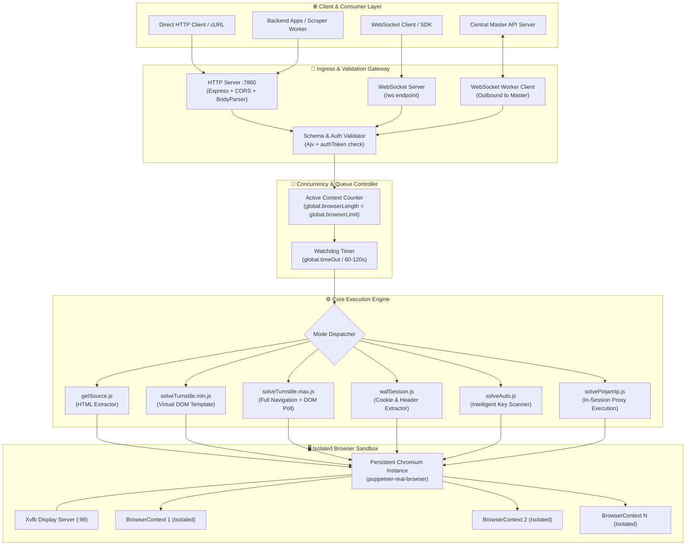
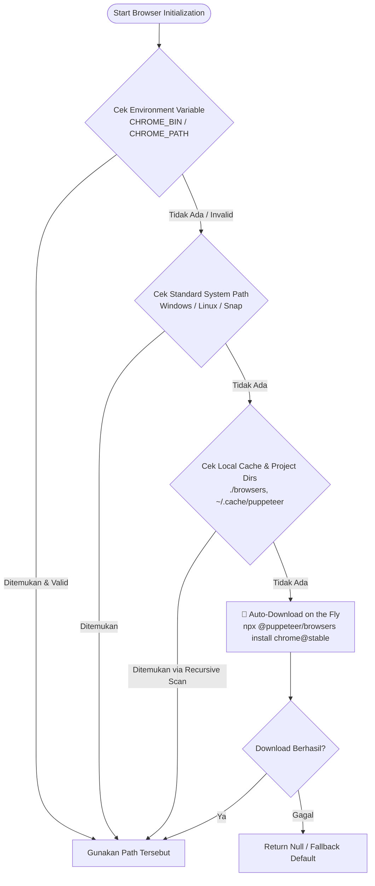
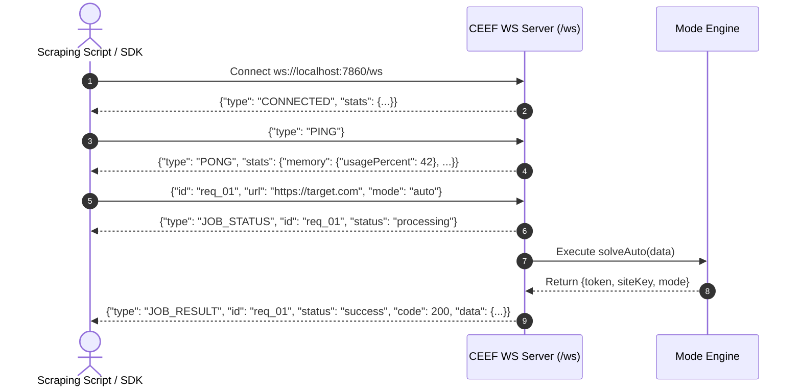
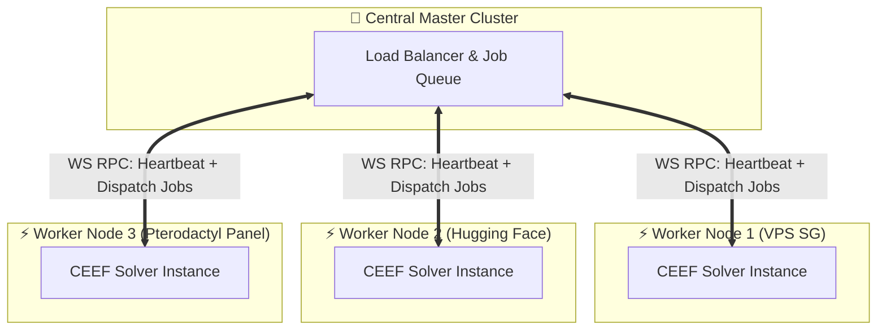

# 🏛️ Arsitektur Internal & Mekanisme Mendalam CEEF WAF Solver

Dokumen ini membedah secara komprehensif seluruh arsitektur teknis, alur data (*data flow*), manajemen proses (*process lifecycle*), sistem isolasi memori, hingga mekanisme bypass proteksi Cloudflare (WAF & Turnstile) yang diimplementasikan di dalam **CEEF WAF Solver**.

---

## 📑 Daftar Isi
1. [Gambaran Umum Sistem](#1-gambaran-umum-sistem)
2. [Diagram Arsitektur Tingkat Tinggi](#2-diagram-arsitektur-tingkat-tinggi)
3. [Mekanisme Deteksi & Resolusi Binary Browser](#3-mekanisme-deteksi--resolusi-binary-browser)
4. [Manajemen Browser Lifecycle & Browser Context](#4-manajemen-browser-lifecycle--browser-context)
5. [Arsitektur Komunikasi Ganda: HTTP REST & WebSocket RPC](#5-arsitektur-komunikasi-ganda-http-rest--websocket-rpc)
6. [Arsitektur Distributed Cluster (Worker Mode)](#6-arsitektur-distributed-cluster-worker-mode)
7. [Anatomi & Deep-Dive Proteksi Cloudflare](#7-anatomi--deep-dive-proteksi-cloudflare)
8. [Benchmarking Resource & Analisis Performa](#8-benchmarking-resource--analisis-performa)

---

## 1. Gambaran Umum Sistem

CEEF WAF Solver dibangun di atas ekosistem **Node.js** dengan kombinasi:
- **Express.js**: Menangani REST API HTTP inbound dengan validasi skema JSON berbasis **Ajv**.
- **WebSocket (ws)**: Menyediakan interface dua arah (*bidirectional*) baik sebagai **Inbound Server** untuk klien maupun **Outbound Worker Client** untuk cluster terdistribusi.
- **puppeteer-real-browser**: Modul automasi browser tingkat lanjut yang mem-patch Chromium untuk mengeliminasi flag `navigator.webdriver`, memodifikasi CDP (*Chrome DevTools Protocol*), dan mengemulasikan perilaku input pengguna yang alami.
- **Xvfb (X Virtual Framebuffer)**: Menyediakan layar virtual grafis di lingkungan Linux/Docker tanpa monitor fisik (*headless-less execution*), sehingga Cloudflare mendeteksi sesi sebagai browser GUI nyata (bukan headless standar yang mudah di-fingerprint).

---

## 2. Diagram Arsitektur Tingkat Tinggi



---

## 3. Mekanisme Deteksi & Resolusi Binary Browser

File: `src/module/getChromePath.js`

Salah satu kendala terbesar saat menjalankan browser automasi di berbagai platform (Docker, Ubuntu VPS, Pterodactyl Panel, Windows Dev, Alpine/Debian) adalah lokasi binary Chrome/Chromium yang sering berpindah atau bahkan belum terinstall.

CEEF mengimplementasikan algoritma **4-Tier Recursive Discovery & Auto-Provisioning**:



### Penjelasan Tahapan:
1. **Tier 1 - Environment Override**: Memeriksa `process.env.CHROME_BIN` atau `process.env.CHROME_PATH`. Sangat ideal untuk konfigurasi Dockerfile custom.
2. **Tier 2 - Sistem Operasi Native**:
   - **Windows**: Mencari di `C:\Program Files\Google\Chrome\Application\chrome.exe`, `C:\Program Files (x86)\...`, dan `%LOCALAPPDATA%`.
   - **Linux**: Mencari di `/usr/bin/chromium`, `/usr/bin/chromium-browser`, `/usr/bin/google-chrome`, `/snap/bin/chromium`.
3. **Tier 3 - Rekursif Local Cache**: Menggunakan fungsi traversal `findBinaryRecursively()` untuk menelusuri folder `./browsers`, `/home/container/browsers` (khusus Pterodactyl Panel), dan `.cache/puppeteer`.
4. **Tier 4 - Just-In-Time Provisioning**: Jika mesin sama sekali tidak memiliki Chromium (contoh: image Pterodactyl Node.js standar tanpa apt-get), sistem akan mengeksekusi `@puppeteer/browsers install chrome@stable` secara mandiri ke direktori `./browsers` lokal dan langsung menggunakannya.

---

## 4. Manajemen Browser Lifecycle & Browser Context

File: `src/module/createBrowser.js`

### A. Konsep Single Browser Instance vs Multi-Context
Menjalankan browser baru (`puppeteer.launch()`) pada setiap request HTTP adalah kesalahan fatal pada aplikasi scraper:
- **Overhead CPU**: Startup process Chromium memakan 200-500ms dan lonjakan CPU 80-100%.
- **Overhead RAM**: Setiap proses browser utama memakan ~150MB-300MB RAM.
- **Deteksi Anti-Bot**: Pembuatan instance berulang memicu artefak osilasi PID yang mudah dideteksi WAF.

**Solusi CEEF:**
1. CEEF hanya membuat **satu instance Chromium utama** saat startup server (`createBrowser()`).
2. Setiap tugas scraping/solving membuat **`BrowserContext` terisolasi** menggunakan `global.browser.createBrowserContext(...)`.
3. Setelah tugas selesai, `context.close()` dieksekusi seketika.

```
┌──────────────────────────────────────────────────────────┐
│                   Chromium Main Process                  │
│                     (Persistent Instance)                │
├───────────────────┬───────────────────┬──────────────────┤
│   BrowserContext 1│   BrowserContext 2│   BrowserContext N│
│   (Request A)     │   (Request B)     │   (Request C)    │
│   - Isolated Cookie│  - Isolated Cookie│  - Isolated Cookie│
│   - Isolated Cache │  - Isolated Cache │  - Isolated Cache │
│   - Custom Proxy  │   - Custom Proxy  │   - Custom Proxy │
└───────────────────┴───────────────────┴──────────────────┘
```

### B. Auto-Recovery & Crash Resilience
Chromium di lingkungan server dapat mengalami *crash* atau *OOM (Out Of Memory)* akibat situs target yang berat.
CEEF menangani event `disconnected`:
```javascript
browser.on('disconnected', async () => {
    if (global.finished == true) return;
    console.log('Browser disconnected');
    await new Promise(resolve => setTimeout(resolve, 3000));
    await createBrowser();
});
```
Jika browser mati secara mendadak, event listener akan menangkap disconnect, menunggu 3 detik (memberikan waktu OS merapikan dangling process), lalu meluncurkan kembali instance Chromium baru secara transparan tanpa perlu merestart service backend Express.

---

## 5. Arsitektur Komunikasi Ganda: HTTP REST & WebSocket RPC

CEEF mendukung dua paradigma komunikasi sekaligus:

### A. HTTP REST Inbound (`/cf-clearance-scraper`)
- **Protocol**: HTTP/1.1 Synchronous POST.
- **Validasi**: Ajv Schema (`src/module/reqValidate.js`).
- **Use Case**: Integrasi sederhana dengan library HTTP standar seperti `axios`, `requests`, atau `curl`.
- **Proteksi**: Header / Body Token Authentication (`authToken`).
- **Rate Limit / Safety Limit**: Menolak dengan status `429 Too Many Requests` jika `global.browserLength >= global.browserLimit`.

### B. WebSocket Server Inbound (`/ws`)
File: `src/module/wsServer.js`
- **Protocol**: Duplex JSON RPC.
- **Use Case**: Aplikasi scraping real-time yang membutuhkan latensi ultra-rendah tanpa overhead TCP Handshake & TLS Negotiation berulang.
- **Fitur Khusus**:
  - **Live Heartbeat**: Mengirimkan status sistem (`memory.totalMb`, `memory.usedMb`, `memory.usagePercent`, `activeJobs`, `uptimeSeconds`).
  - **Progress State Updates**: Mengirimkan event `JOB_STATUS` (`processing` -> `success`/`error`) secara live ke klien.



---

## 6. Arsitektur Distributed Cluster (Worker Mode)

Dalam skala scraping enterprise (ribuan request per menit), satu instance server solver tidak akan cukup karena batasan core CPU dan RAM.

CEEF dilengkapi built-in **Outbound WebSocket Worker**:
- Jika environment variable `MAIN_WS_URL` didefinisikan (misalnya `ws://central-api.internal:8080/cf-cluster`), CEEF secara otomatis bertindak sebagai **Distributed Node Worker**.
- Worker melakukan registrasi ke Master Server menggunakan `WORKER_ID` dan `WORKER_SECRET`.
- Worker secara periodik (setiap 15 detik) mengirimkan data telemetri RAM, status browser, dan jumlah job aktif.
- Master Server mendistribusikan job challenge ke worker yang memiliki load terendah (*Load Balancing by Resource Availability*).
- Jika koneksi terputus, worker melakukan *exponential backoff auto-reconnect* setiap 5 detik.



---

## 7. Anatomi & Deep-Dive Proteksi Cloudflare

Mengapa scraper biasa (seperti Axios, Requests, Puppeteer standar) diblokir oleh Cloudflare, dan bagaimana CEEF melewatinya?

```
┌────────────────────────────────────────────────────────────────────────────┐
│                       Lapisan Pertahanan Cloudflare                        │
├────────────────────────────────┬───────────────────────────────────────────┤
│ 1. TLS/JA3 Fingerprint         │ Cek cipher suite, TLS extensions, alpn    │
├────────────────────────────────┼───────────────────────────────────────────┤
│ 2. HTTP/2 Fingerprint (Akamai) │ Cek SETTINGS frame, WINDOW_UPDATE, priority│
├────────────────────────────────┼───────────────────────────────────────────┤
│ 3. IP Reputation & ASN Scoring │ Cek apakah IP datacenter, proxy, VPN      │
├────────────────────────────────┼───────────────────────────────────────────┤
│ 4. JavaScript Challenge / WAF  │ Eksekusi perhitungan VM obfuscated di browser│
├────────────────────────────────┼───────────────────────────────────────────┤
│ 5. Browser Fingerprinting      │ Cek WebGL, Canvas, Audio, navigator flags │
├────────────────────────────────┼───────────────────────────────────────────┤
│ 6. Turnstile Captcha           │ Interaksi token interaktif / non-interaktif│
└────────────────────────────────┴───────────────────────────────────────────┘
```

### 1. Masalah Header & TLS Fingerprint
Cloudflare memvalidasi kecocokan antara **User-Agent** dan **JA3 Fingerprint** (urutan cipher suite SSL/TLS).
Jika Anda mengirimkan User-Agent Chrome versi 125 tetapi menggunakan library TLS Node.js standar, Cloudflare mendeteksi anomali ini dan langsung menampilkan status `403 Forbidden` atau Challenge page.

**Strategi CEEF:**
1. Menggunakan Chromium asli melalui virtual framebuffer sehingga TLS Handshake dilakukan oleh engine Chromium yang 100% identik dengan pengguna asli.
2. Endpoint `waf-session` mengekstrak `cookies` (`cf_clearance`) bersamaan dengan header `user-agent` dan `accept-language` yang identik.
3. Klien dapat meneruskan kombinasi ini ke engine seperti **CycleTLS** atau **tls-client** yang mengemulasikan JA3 fingerprint yang sama persis.

### 2. Turnstile Interception & Virtual DOM Injection
Pada mode `turnstile-min`, CEEF menggunakan teknik mutakhir:
- Alih-alih merender seluruh HTML situs target (yang mungkin berukuran 5MB dengan 50 script pelacak yang lambat), CEEF mencegat request halaman utama via `page.setRequestInterception(true)`.
- Request dokumen utama digantikan oleh template lokal `src/data/fakePage.html` yang hanya memuat script resmi Cloudflare Turnstile (`challenges.cloudflare.com/turnstile/v0/api.js`) dan menginjeksikan `siteKey` target.
- Hasil: Token Turnstile berhasil digenerate dalam waktu **2-4 detik** dengan konsumsi RAM **hanya ~20MB per context**, dibandingkan mode konvensional yang memakan waktu 10-15 detik dan 150MB RAM!

---

## 8. Benchmarking Resource & Analisis Performa

| Parameter | Mode `source` | Mode `turnstile-min` | Mode `turnstile-max` | Mode `waf-session` | Mode `auto` | Mode `pinjam-ip` |
| :--- | :--- | :--- | :--- | :--- | :--- | :--- |
| **Rata-rata Waktu (Latency)** | 3.5s - 6.0s | **1.8s - 3.5s** | 4.5s - 8.0s | 3.0s - 5.5s | 4.0s - 7.0s | 3.0s - 6.0s |
| **Konsumsi RAM / Context** | ~80 MB | **~25 MB** | ~120 MB | ~65 MB | ~90 MB | ~85 MB |
| **Konsumsi Bandwidth** | Sedang | **Sangat Rendah** | Tinggi | Sedang | Sedang | Sedang |
| **Kebutuhan SiteKey** | N/A | **Wajib** | Tidak | N/A | **Otomatis** | N/A |
| **Kesesuaian Kasus** | Scrape HTML | API Captcha Solver | Dynamic Widget | Session Generator | Solusi All-in-One | IP-Bound Clearance |

### Rumus Perhitungan Concurrency Server:
Untuk menentukan nilai optimal `browserLimit` pada server Anda:
$$\text{Optimal browserLimit} = \frac{\text{Free RAM (MB)} - 350\text{MB (Chromium Base)}}{\text{Rata-rata RAM per Context (80MB)}}$$

*Contoh: Server VPS dengan sisa RAM 4096 MB:*
$$\text{browserLimit} = \frac{4096 - 350}{80} \approx \mathbf{46\text{ concurrent contexts}}$$
