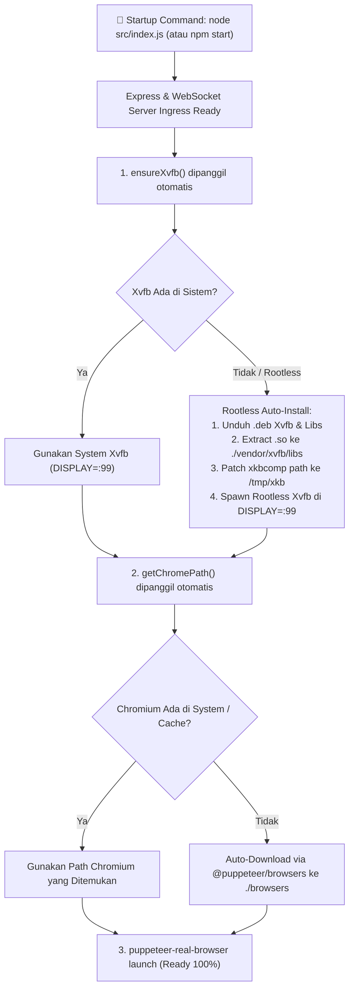

# 🚀 Panduan Deployment & Optimasi Produksi

Dokumen ini menjelaskan prosedur instalasi, konfigurasi environment, dan *deployment* **CEEF WAF Solver** di berbagai infrastruktur: **Docker, Hugging Face Spaces, Pterodactyl Panel, Linux VPS (Ubuntu/Debian) dengan Systemd, serta Windows**.

---

## 📑 Daftar Isi
1. [Daftar Environment Variables](#1-daftar-environment-variables)
2. [Deployment dengan Docker & Docker Compose](#2-deployment-dengan-docker--docker-compose)
3. [Deployment pada Hugging Face Spaces](#3-deployment-pada-hugging-face-spaces)
4. [Deployment pada Pterodactyl Panel / Game Panel](#4-deployment-pada-pterodactyl-panel--game-panel)
5. [Deployment pada VPS Ubuntu / Debian (Systemd Service)](#5-deployment-pada-vps-ubuntu--debian-systemd-service)
6. [Tuning Performa, Memory Sizing & Swap](#6-tuning-performa-memory-sizing--swap)

---

## 1. Daftar Environment Variables

Berikut adalah tabel parameter konfigurasi yang didukung CEEF melalui variabel lingkungan (*environment variables*):

| Variabel | Tipe | Nilai Default | Deskripsi |
| :--- | :--- | :--- | :--- |
| `PORT` / `SERVER_PORT` | Integer | `7860` | Port tempat Express & WebSocket server mendengarkan koneksi. |
| `browserLimit` | Integer | `20` | Jumlah maksimal sesi/konteks browser simultan yang diizinkan. Request melebihi batas ini menerima HTTP 429. |
| `timeOut` | Integer | `120000` (ms) | Batas waktu maksimal penyelesaian challenge sebelum dibatalkan (*abort*). |
| `authToken` | String | `null` | Token rahasia otorisasi. Jika diset, klien wajib menyertakan token ini dalam payload JSON. |
| `CHROME_BIN` / `CHROME_PATH`| String | `null` | Path absolut manual ke binary executable Chromium/Chrome. |
| `SKIP_LAUNCH` | String | `"false"` | Jika `"true"`, peluncuran Chromium otomatis saat startup dinonaktifkan (berguna untuk unit testing). |
| `MAIN_WS_URL` | String | `null` | URL WebSocket Master Server untuk mengaktifkan mode **Distributed Worker**. |
| `WORKER_ID` | String | Auto-generate | Identitas unik worker node saat terhubung ke Master Server. |
| `WORKER_SECRET` | String | `default_cf_worker_secret_2026` | Kunci otentikasi worker ke Master Server. |

---

## 2. Deployment dengan Docker & Docker Compose

### A. Menjalankan Langsung via Docker CLI
```bash
# Build image lokal
docker build -t ceef-waf-solver:latest .

# Jalankan container dengan alokasi /dev/shm yang memadai
docker run -d \
  --name ceef-solver \
  --restart unless-stopped \
  -p 7860:7860 \
  --shm-size=2gb \
  -e PORT=7860 \
  -e browserLimit=25 \
  -e timeOut=60000 \
  -e authToken=MySuperSecretToken2026 \
  ceef-waf-solver:latest
```

> [!IMPORTANT]
> Selalu sertakan argumen `--shm-size=2gb` pada Docker. Chromium menggunakan memori bersama (*shared memory*) untuk merender halaman dan kanvas. Tanpa alokasi shm yang cukup, Chromium akan sering mengalami *crash* saat membuka situs berat.

---

### B. Konfigurasi `docker-compose.yml`
```yaml
version: '3.8'

services:
  ceef-solver:
    build: .
    container_name: ceef-waf-solver
    restart: always
    ports:
      - "7860:7860"
    shm_size: '2gb'
    environment:
      - PORT=7860
      - browserLimit=30
      - timeOut=60000
      - authToken=SecureTokenABC123
    deploy:
      resources:
        limits:
          cpus: '4.0'
          memory: 4096M
        reservations:
          cpus: '1.0'
          memory: 1024M
    healthcheck:
      test: ["CMD", "wget", "-qO-", "http://localhost:7860/"]
      interval: 30s
      timeout: 10s
      retries: 3
```

---

## 3. Deployment pada Hugging Face Spaces

CEEF dirancang agar kompatibel penuh dengan **Hugging Face Spaces (Docker SDK)** secara gratis:

1. Buat Space baru di Hugging Face dengan memilih **SDK: Docker**.
2. Pastikan file `README.md` pada repositori Anda memiliki metadata header:
   ```yaml
   ---
   title: Ceef WAF Solver
   emoji: 🚀
   colorFrom: blue
   colorTo: green
   sdk: docker
   pinned: false
   app_port: 7860
   ---
   ```
3. Push kode repositori ke remote git Hugging Face.
4. Masuk ke tab **Settings > Variables and secrets** pada Space Anda jika ingin menambahkan `authToken` atau `browserLimit`.

---

## 4. Deployment pada Pterodactyl Panel / Game Panel / Rootless Container

Pterodactyl Panel dan container hosting minimal umumnya menjalankan container Node.js unprivileged tanpa akses `sudo`, `apt-get`, atau bahkan shell `bash`.

CEEF dirancang **100% Pure Node.js Native**, sehingga Anda **tidak wajib menggunakan `bash start.sh`**. Anda cukup menjalankan perintah standar Node.js:

```bash
npm start
# atau
node src/index.js
```

### Mekanisme Self-Healing Otomatis di Node.js:
1. **Auto-Install Rootless Xvfb & Shared Libraries (`src/module/xvfbManager.js`)**:
   - Jika `Xvfb` tidak ada di sistem operasi container, Node.js secara otomatis mengunduh paket `.deb` resmi Ubuntu (`xvfb`, `libunwind8`, `libXfont2`, `libfontenc1`, `libxkbfile1`, `x11-xkb-utils`, `xkb-data`).
   - Mengekstrak semua file `.so` ke `./vendor/xvfb/libs`, mem-patch binary `xkbcomp` ke `/tmp/xkb`, lalu menjalankan virtual display `:99` secara mandiri **tanpa butuh izin root/sudo**.
2. **Auto-Install Chromium (`src/module/getChromePath.js`)**:
   - Jika Chrome/Chromium belum terpasang di sistem atau cache, sistem mengunduh binary Chrome stable via `@puppeteer/browsers` ke direktori `./browsers`.



### Konfigurasi Egg Pterodactyl:
- **Startup Command**: `node src/index.js` *(atau `npm start`)*
- **Environment Variables**:
  - `SERVER_PORT`: `{{SERVER_PORT}}`
  - `browserLimit`: `15`

---

## 5. Deployment pada VPS Ubuntu / Debian (Systemd Service)

### A. Install Dependensi Sistem
```bash
sudo apt update && sudo apt install -y \
  chromium-browser \
  xvfb \
  fonts-liberation \
  libnss3 \
  nodejs \
  npm \
  git
```

### B. Clone & Install Project
```bash
cd /opt
sudo git clone https://github.com/zfcsoftware/cf-clearance-scraper ceef-solver
cd ceef-solver
sudo npm install --production
```

### C. Buat Service Systemd (`/etc/systemd/system/ceef-solver.service`)
```ini
[Unit]
Description=CEEF WAF Solver Production Service
After=network.target

[Service]
Type=simple
User=root
WorkingDirectory=/opt/ceef-solver
Environment=NODE_ENV=production
Environment=PORT=7860
Environment=browserLimit=25
Environment=timeOut=60000
Environment=DISPLAY=:99
ExecStartPre=/usr/bin/Xvfb :99 -screen 0 1280x1024x24 -ac
ExecStart=/usr/bin/node /opt/ceef-solver/src/index.js
Restart=always
RestartSec=5
LimitNOFILE=65535

[Install]
WantedBy=multi-user.target
```

### D. Aktifkan & Jalankan Service
```bash
sudo systemctl daemon-reload
sudo systemctl enable --now ceef-solver
sudo systemctl status ceef-solver
```

---

## 6. Tuning Performa, Memory Sizing & Swap

Chromium membutuhkan RAM yang elastis saat membuka website yang memuat skrip enkripsi berat.

### Menambahkan Swap Memory (Wajib pada VPS RAM 1GB - 2GB):
```bash
# Buat file swap 4GB
sudo fallocate -l 4G /swapfile
sudo chmod 600 /swapfile
sudo mkswap /swapfile
sudo swapon /swapfile

# Jadikan permanen saat reboot
echo '/swapfile none swap sw 0 0' | sudo tee -a /etc/fstab
```

### Rekomendasi Alokasi Spesifikasi Server:
- **1 vCPU / 2GB RAM**: `browserLimit=10` (~5-8 request/detik)
- **2 vCPU / 4GB RAM**: `browserLimit=25` (~15-20 request/detik)
- **4 vCPU / 8GB RAM**: `browserLimit=60` (~40-50 request/detik)
