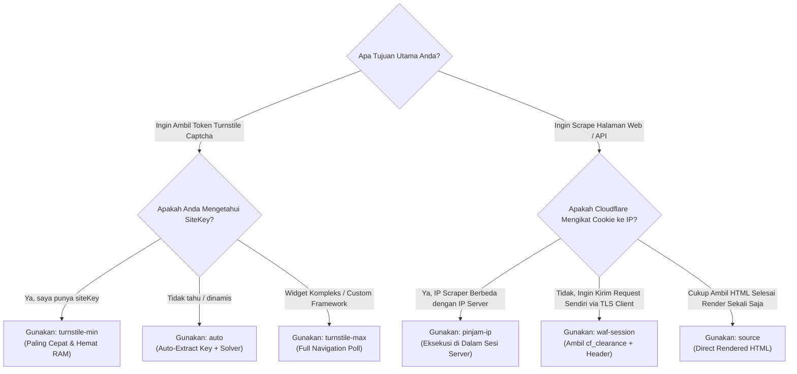
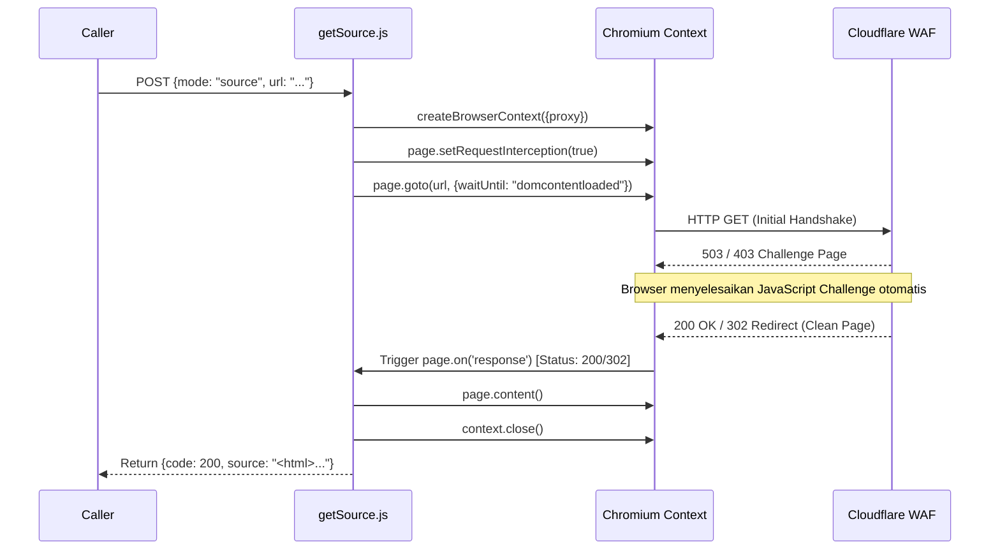
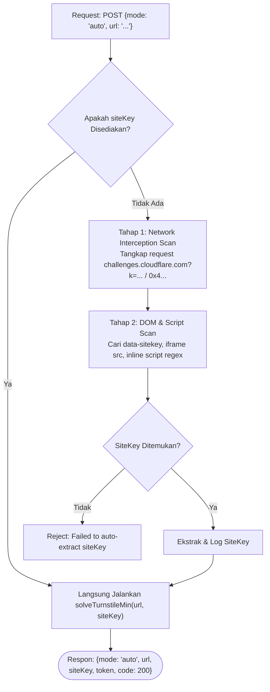

# 🧩 Panduan Lengkap Mode Operasi & Solver Mechanics

Dokumen ini membedah secara mendalam setiap **Mode Operasi** yang tersedia di dalam **CEEF WAF Solver**, cara kerja di balik layar, logika kode sumber, perbandingan efisiensi, dan panduan memilih mode yang tepat untuk kebutuhan scraping Anda.

---

## 📑 Daftar Isi
1. [Matriks Perbandingan & Panduan Pemilihan Mode](#1-matriks-perbandingan--panduan-pemilihan-mode)
2. [Mode 1: `source` (Full Rendered HTML Scraper)](#2-mode-1-source-full-rendered-html-scraper)
3. [Mode 2: `turnstile-min` (Lightweight Virtual DOM Solver)](#3-mode-2-turnstile-min-lightweight-virtual-dom-solver)
4. [Mode 3: `turnstile-max` (Full Page Dynamic Turnstile Solver)](#4-mode-3-turnstile-max-full-page-dynamic-turnstile-solver)
5. [Mode 4: `waf-session` (Cookie Clearance & Header Generator)](#5-mode-4-waf-session-cookie-clearance--header-generator)
6. [Mode 5: `auto` (Intelligent Auto-Detect & Solve)](#6-mode-5-auto-intelligent-auto-detect--solve)
7. [Mode 6: `pinjam-ip` / `ip-bound` (In-Session Tunnel Scraper)](#7-mode-6-pinjam-ip--ip-bound-in-session-tunnel-scraper)

---

## 1. Matriks Perbandingan & Panduan Pemilihan Mode



| Mode | Input Wajib | Kecepatan | Konsumsi RAM | Output Utama | Cocok Untuk |
| :--- | :--- | :--- | :--- | :--- | :--- |
| **`turnstile-min`** | `url`, `siteKey` | ⚡ **1.8s - 3.5s** | 🟢 **~25 MB** | `token` | Integrasi backend captcha bypass tercepat. |
| **`auto`** | `url` | ⚡ **4.0s - 7.0s** | 🟡 **~90 MB** | `token`, `siteKey` | Solver otomatis tanpa perlu mencari siteKey manual. |
| **`turnstile-max`** | `url` | ⏳ **4.5s - 8.0s** | 🔴 **~120 MB** | `token` | Widget Turnstile non-standar / SPA kompleks. |
| **`waf-session`** | `url` | ⚡ **3.0s - 5.5s** | 🟡 **~65 MB** | `cookies`, `headers` | Scraper massal via CycleTLS / tls-client. |
| **`source`** | `url` | ⚡ **3.5s - 6.0s** | 🟡 **~80 MB** | `source` (HTML) | Web scraping halaman tunggal berproteksi WAF. |
| **`pinjam-ip`** | `url`, (`method`, `postData`) | ⚡ **3.0s - 6.0s** | 🟡 **~85 MB** | `response`, `cf_clearance` | Solusi mutlak untuk Cloudflare IP-Bound protection. |

---

## 2. Mode 1: `source` (Full Rendered HTML Scraper)

File: `src/endpoints/getSource.js`

### A. Cara Kerja & Logika Internal
Mode ini membuka target URL dengan browser Chromium nyata, menunggu hingga halaman berhasil menyelesaikan challenge proteksi Cloudflare (menghasilkan status HTTP 200 atau 302 pada URL target), lalu mengambil snapshot DOM HTML yang telah dirender sempurna.



### B. Fitur Keunggulan:
- **Event-Driven Resolution**: Menggunakan listener `page.on("response")` sehingga tidak membuang waktu tunggu fixed (`sleep`) yang tidak perlu.
- **Auto Proxy Authentication**: Mendukung upstream proxy dengan username & password melalui `page.authenticate()`.
- **Resource Cleanup**: Browser context ditutup seketika setelah konten diperoleh untuk membebaskan RAM.

---

## 3. Mode 2: `turnstile-min` (Lightweight Virtual DOM Solver)

File: `src/endpoints/solveTurnstile.min.js` & `src/data/fakePage.html`

### A. Cara Kerja & Logika Internal
Mode ini merupakan mahakarya optimasi resource. Alih-alih memuat seluruh asset website target (CSS 2MB, JS bundle 10MB, gambar, analytics, tracker) yang memperlambat browser:
1. CEEF mengaktifkan `page.setRequestInterception(true)`.
2. Saat browser meminta dokumen utama URL target, CEEF mencegatnya dan langsung menyajikan template virtual lokal `fakePage.html`.
3. Template tersebut hanya memuat skrip resmi Turnstile dan merender widget Turnstile dengan `siteKey` yang diberikan di bawah origin domain yang valid.
4. Nilai token yang dihasilkan diekstrak langsung dari elemen `[name="cf-response"]`.

```html
<!-- Inti dari src/data/fakePage.html -->
<!DOCTYPE html>
<html>
<head>
    <script src="https://challenges.cloudflare.com/turnstile/v0/api.js" async defer></script>
</head>
<body>
    <div class="cf-turnstile" data-sitekey="<site-key>"></div>
</body>
</html>
```

### B. Mengapa Sangat Direkomendasikan?
- **Kecepatan 3x Lipat**: Waktu solve terpangkas dari 10 detik menjadi **1.8 - 3 detik**.
- **Efisiensi RAM Ekstrem**: Hanya mengonsumsi **~25MB RAM**, memungkinkan 1 server menangani ratusan solve paralel secara simultan.

---

## 4. Mode 3: `turnstile-max` (Full Page Dynamic Turnstile Solver)

File: `src/endpoints/solveTurnstile.max.js`

### A. Cara Kerja & Logika Internal
Beberapa aplikasi modern (Single Page Applications, React/Vue/Angular, atau form terproteksi tingkat tinggi) merender widget Turnstile secara dinamis melalui JavaScript internal atau mengikat token ke state form tertentu.

Mode `turnstile-max` menavigasi halaman asli secara penuh, lalu menjalankan algoritma **3-Tier Polling Extraction** hingga 60 iterasi (30 detik):
1. **Tier 1 - DOM Input Selector**: Memeriksa elemen `[name="cf-turnstile-response"]`, `[name="cf-response"]`, `textarea[name="cf-turnstile-response"]`, atau `input[name="g-recaptcha-response"]`.
2. **Tier 2 - Global Window API**: Memanggil fungsi resmi Turnstile `window.turnstile.getResponse()` jika tersedia di runtime window.
3. **Tier 3 - Heuristic Pattern Scanner**: Memindai seluruh elemen `<input>` dan `<textarea>` di halaman menggunakan ekspresi reguler untuk mendeteksi signature token Cloudflare (`0.xxx`, `1.xxx`, atau `0x...` dengan panjang > 50 karakter).

---

## 5. Mode 4: `waf-session` (Cookie Clearance & Header Generator)

File: `src/endpoints/wafSession.js`

### A. Cara Kerja & Logika Internal
Untuk arsitektur scraping skala besar, mengirim setiap request melalui browser Chromium akan menghabiskan resource server. Solusi standarnya adalah menggunakan **Hybrid Scraping Architecture**:
1. Gunakan CEEF untuk mendapatkan sesi awal yang lolos WAF.
2. Gunakan library HTTP cepat berbasis TLS Fingerprint (seperti CycleTLS atau tls-client di Go/Python) untuk melakukan ribuan request berikutnya dengan cookie sesi tersebut.

`wafSession.js` melakukan:
1. Melewati challenge WAF Cloudflare.
2. Mengambil seluruh cookie sesi (`cf_clearance`, `__cf_bm`, dll.) via `page.cookies()`.
3. Mengambil header `user-agent` dan mengemulasikan `accept-language` yang akurat.
4. Menghapus header internal yang berpotensi menyebabkan *mismatch* (`content-length`, `accept-encoding`, `content-type`).

---

## 6. Mode 5: `auto` (Intelligent Auto-Detect & Solve)

File: `src/endpoints/solveAuto.js`

### A. Cara Kerja & Logika Internal
Seringkali pengguna tidak mengetahui nilai `siteKey` dari website target, atau website tersebut memiliki beberapa sub-key dinamis.

Mode `auto` menggabungkan kecerdasan pendeteksian otomatis dengan kecepatan `turnstile-min`:



---

## 7. Mode 6: `pinjam-ip` / `ip-bound` (In-Session Tunnel Scraper)

File: `src/endpoints/solvePinjamIp.js`

### A. Masalah: Cloudflare IP-Bound Clearance
Pada level proteksi tertinggi Cloudflare (*Cloudflare Super Bot Fight Mode* atau *Under Attack Mode*), cookie `cf_clearance` di-hash secara kriptografis bersama **IP Address publik** mesin yang menyelesaikan challenge tersebut:

$$\text{Clearance Signature} = \mathcal{H}(\text{Client IP} \parallel \text{User-Agent} \parallel \text{Secret Salt})$$

Akibatnya: Jika Anda menyelesaikan challenge di server CEEF (IP: `103.x.x.x`), lalu mencoba menggunakan cookie tersebut dari laptop lokal Anda (IP: `36.x.x.x`), Cloudflare akan **langsung memblokir request** dengan status `403 Forbidden` karena IP tidak cocok (*IP mismatch*)!

### B. Solusi CEEF: "Pinjam IP" Tunneling
Mode `pinjam-ip` memecahkan masalah ini dengan cerdas:
1. Browser CEEF di server membuka target URL dan menyelesaikan challenge hingga lolos.
2. Jika request berupa `GET`: CEEF langsung mengembalikan seluruh konten halaman yang sudah lolos.
3. Jika request berupa `POST`: CEEF mengeksekusi `fetch()` internal **langsung dari dalam konteks halaman browser yang terautentikasi** menggunakan IP server itu sendiri:
   ```javascript
   responseData = await page.evaluate(async ({ reqUrl, reqBody, headers }) => {
       const res = await fetch(reqUrl, {
           method: "POST",
           headers: { "Content-Type": "application/json", ...headers },
           body: typeof reqBody === "object" ? JSON.stringify(reqBody) : reqBody
       });
       return { status: res.status, body: await res.text() };
   }, { reqUrl: url, reqBody: postData, headers: customHeaders });
   ```
4. Hasil respon dikembalikan utuh ke klien bersama dengan cookie dan header sesi.
